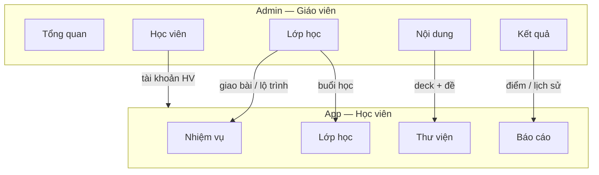

# Design MVP — Admin (Giáo viên) + Học viên

> Mục tiêu: app **nội bộ** — 1 GV (hoặc vài GV) quản lý nhiều HV.  
> **Không** clone cấu trúc UUP (marketplace, kinh doanh, ví xu, AI speaking, RBAC phức tạp).  
> Tham chiếu: `TINH-NANG-ADMIN-MRS-UYEN.md`, `TINH-NANG-HOC-VIEN.md`, `KE-HOACH-SPRINT.md`.

---

## 1. Nguyên tắc sản phẩm

| Nguyên tắc | Ý nghĩa |
|------------|---------|
| 2 vai trò | `teacher` (admin nội bộ) · `student` |
| 1 trung tâm | Không multi-tenant / không bán gói |
| Nội dung do GV seed/CRUD tối thiểu | Không kho đề marketplace |
| HV chỉ thấy thứ liên quan lớp mình | Không catalog công khai hàng trăm đề |
| UI gọn | Bottom nav ≤ 4 mục HV; sidebar ≤ 6 mục GV |

**Brand gợi ý (lấy cảm hứng site gốc, không bắt chước balloon marketing):**

- Primary: `#002854` (navy)  
- Accent CTA: `#F5AC3D` (amber)  
- Nền app: trắng / xám rất nhạt — tránh purple AI gradient  
- Font: 1 sans rõ ràng (đã có trong frontend thì giữ)

---

## 2. Kiến trúc thông tin (IA)



---

## 3. Admin (Giáo viên) — màn hình

Route gợi ý prefix `/teacher` hoặc subdomain admin cùng app Next.js (role gate).

### 3.1. Tổng quan

- 4 số: HV hoạt động · bài hoàn thành · lượt làm · điểm TB tuần  
- Danh sách lớp đang diễn ra (nhanh)

### 3.2. Lớp học

| Màn | Chức năng |
|-----|-----------|
| Danh sách lớp | Tạo / sửa / ẩn lớp; số HV; trạng thái |
| Chi tiết lớp | Tab: **Lộ trình** · **Giao bài** · **Học viên** · **Cài đặt** |
| Lộ trình | Buổi → gắn item (đề / deck) — polymorphic như model đã có |
| Giao bài | Chọn đề/deck → giao cả lớp hoặc vài HV; deadline tùy chọn |
| Học viên trong lớp | Thêm/xóa HV; reset mật khẩu |
| Cài đặt | Tên, GV phụ (optional), ngày bắt đầu–KT |

**Cắt bỏ so với UUP:** điểm danh/nhận xét phức tạp, báo cáo chất lượng Beta đầy đủ, nhiều cơ sở.

### 3.3. Học viên

- Danh sách + tìm email/tên  
- Tạo HV (email + mật khẩu tạm) / import CSV đơn giản (sau)  
- Gắn vào lớp  
- Khóa / mở tài khoản  

**Cắt bỏ:** loại “Khách hàng”, cộng xu, cơ sở nhiều chi nhánh.

### 3.4. Nội dung

Hai tab đủ dùng Sprint 1–2:

1. **Từ vựng (Deck)** — CRUD deck + cards (term, meaning, IPA, audio optional)  
2. **Đề thi** — CRUD đề tối thiểu: Part → Question (MCQ trước); ẩn đáp án khi trả HV  

**Cắt bỏ:** IELTS Simulation editor, tạo đề AI, kho đề chung, bài giảng/video/game, bài viết blog.

### 3.5. Kết quả

- Bảng attempt: HV · đề · điểm · thời gian · xem chi tiết (đúng/sai + lời giải)  
- Filter theo lớp / đề / khoảng ngày  

**Cắt bỏ:** luyện nói AI history, export phức tạp.

---

## 4. Học viên — màn hình

App đã có skeleton: Nhiệm vụ · Lớp học · Thư viện · Báo cáo.

### 4.1. Login

- Email + mật khẩu (Sanctum token)  
- Không đăng ký công khai — GV tạo tài khoản  

### 4.2. Nhiệm vụ

- List nhiệm vụ được giao / tự thêm  
- Trạng thái: chưa làm · đang làm · xong  
- CTA **Làm ngay** → đề hoặc deck  

### 4.3. Lớp học

- Lớp đang học (thường 1 lớp)  
- Lộ trình theo buổi → mở item (đề/deck)  
- Ghi chú buổi (read-only nếu GV có ghi)

### 4.4. Thư viện

| Con | UI |
|-----|-----|
| Từ vựng | List deck → học thẻ (lật, prev/next, phát âm, lưu tiến độ) |
| Đề thi | List đề được phép → intro (thời lượng, số câu) → làm bài → kết quả |

**Cắt bỏ:** tin tức, tài liệu marketing, filter IELTS/TOEIC catalog lớn.

### 4.5. Làm bài (core)

1. Intro: tên, thời lượng, số câu, nút Bắt đầu  
2. Làm: 1 câu / hoặc theo part; timer hiển thị (deadline từ server)  
3. Nộp xác nhận  
4. Kết quả: điểm, số đúng, review xanh/đỏ + lời giải  

Loại câu MVP: `multiple_choice` → thêm `fill_blank` / `select` nếu kịp.

### 4.6. Báo cáo

- 4 chỉ số: điểm TB · số bài · lượt làm · thời gian học (ước lượng)  
- Lịch sử attempt gần đây  

---

## 5. Wireflow chính

### HV làm đề được giao

```
Nhiệm vụ → Làm ngay → Intro đề → Làm bài → Nộp → Kết quả
                ↑
         (cũng từ Lớp học / Thư viện)
```

### GV giao đề

```
Lớp học → chi tiết → Giao bài → chọn đề → giao → HV thấy ở Nhiệm vụ
```

### GV xem điểm

```
Kết quả → lọc lớp → mở attempt → xem chi tiết câu
```

---

## 6. Layout UI

### Học viên (mobile-first)

```
┌─────────────────────────┐
│  Header: chào tên · out │
│  Nội dung 1 cột         │
│                         │
├─────────────────────────┤
│ Nhiệm vụ │ Lớp │ Thư viện │ Báo cáo │
└─────────────────────────┘
```

### Giáo viên (desktop-first)

```
┌──────┬──────────────────┐
│ Logo │  Top: GV name    │
│ ---- │                  │
│ Tổng │  Content         │
│ Lớp  │                  │
│ HV   │                  │
│ Nội  │                  │
│ KQ   │                  │
└──────┴──────────────────┘
```

---

## 7. Ưu tiên ship (khớp sprint)

| Sprint | Admin | Học viên |
|--------|-------|----------|
| 1 | Seed HV/GV, deck API | Login, Thư viện → Từ vựng |
| 2 | Seed/CRUD đề tối thiểu | List đề → làm → kết quả |
| 3 | Lớp + giao bài + kết quả list | Nhiệm vụ, Lớp, Báo cáo |
| 4 | CRUD lớp/HV trên UI | Polish |

---

## 8. Không làm (backlog rõ)

- Portal marketing / tin tức / SEO  
- Kho đề tải từ store  
- AI speaking / chấm AI / ví xu  
- Điểm danh buổi học  
- Multi-cơ sở, RBAC nhiều role  
- Google login, đăng ký tự do  

Khi cô giáo cần tính năng UUP nào → thêm issue riêng, không nhồi vào MVP.
