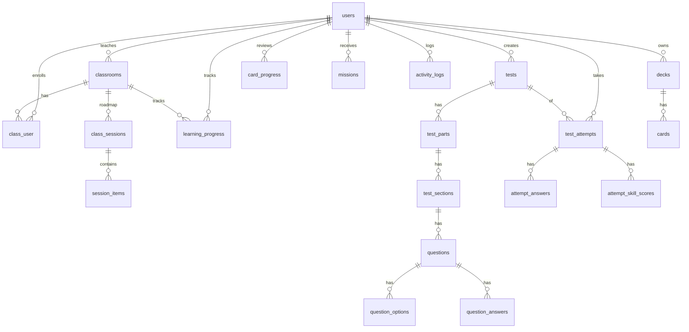

# Thiết kế Database — MVP Anh ngữ (nội bộ)

> **Chỉ design** — chưa chỉnh migration/model trong bước này.  
> Tham chiếu: `DESIGN-ADMIN-HOC-VIEN.md`, `PHAN-TICH-DE-THI.md`, migration hiện có (`2026_07_10_*`).

---

## 1. Mục tiêu & nguyên tắc

| Nguyên tắc | Áp dụng |
|------------|---------|
| 2 vai trò chính | `teacher` · `student` (`admin` giữ optional siêu quyền, không multi-tenant) |
| 1 trung tâm | Không bảng `branches` / `organizations` / wallet / marketplace |
| Polymorphic có kiểm soát | Chỉ dùng morph khi đích rõ: `Test` \| `Deck` |
| Engine đề gọn | 4 loại câu; Part có `default` \| `image_drag` |
| Denormalize có chủ đích | `learning_progress`, điểm attempt — chấp nhận, cập nhật khi submit |
| Soft delete | **Không** dùng soft delete MVP (xóa cứng + cascade đủ) |

**DB:** MySQL (Docker). **Auth token:** Sanctum `personal_access_tokens` (Laravel sẵn).

---

## 2. Bản đồ domain (6 nhóm)



| Nhóm | Bảng | Phục vụ UI |
|------|------|------------|
| A. Identity | `users`, tokens | Login, khóa HV |
| B. Lớp & lộ trình | `classrooms`, `class_user`, `class_sessions`, `session_items`, `learning_progress` | Admin Lớp · HV Lớp |
| C. Engine đề | `tests` → `parts` → `sections` → `questions` → `options` (+ `question_answers`) | Nội dung đề · Làm bài |
| D. Bài làm | `test_attempts`, `attempt_answers`, `attempt_skill_scores` | Kết quả GV · Báo cáo HV |
| E. Từ vựng | `decks`, `cards`, `card_progress` | Thư viện vocab |
| F. Nhiệm vụ & log | `missions`, `activity_logs` | Nhiệm vụ · Tổng quan |

---

## 3. Catalog bảng (target)

### A. Identity

#### `users`

| Cột | Kiểu | Ghi chú |
|-----|------|---------|
| id | bigint PK | |
| name | string | |
| email | string unique | |
| email_verified_at | timestamp null | có thể bỏ dùng MVP |
| password | string | |
| role | enum `admin`\|`teacher`\|`student` | default `student` |
| avatar_url | string null | |
| **is_active** | boolean default true | **Bổ sung** — khóa/mở HV |
| remember_token | string null | |
| timestamps | | |

**Index:** `role`, `is_active` (list HV).

> Migration hiện thiếu `is_active` → thêm khi code.

---

### B. Lớp & lộ trình

#### `classrooms`

| Cột | Kiểu | Ghi chú |
|-----|------|---------|
| id | bigint PK | |
| teacher_id | FK → users | GV chính |
| name | string | |
| slug | string unique | |
| cover_url | string null | optional |
| description | text null | |
| **starts_on** | date null | **Bổ sung** — cài đặt lớp |
| **ends_on** | date null | **Bổ sung** |
| is_active | boolean default true | ẩn lớp |
| timestamps | | |

**Không làm MVP:** bảng `classroom_teacher` (GV phụ) — backlog.

#### `class_user` (pivot HV ↔ lớp)

| Cột | Kiểu | Ghi chú |
|-----|------|---------|
| id | bigint PK | |
| classroom_id | FK | |
| user_id | FK | chỉ role student |
| status | enum `studying`\|`finished`\|`paused` | |
| timestamps | | |
| UNIQUE(classroom_id, user_id) | | |

#### `class_sessions` (buổi trong lộ trình)

| Cột | Kiểu | Ghi chú |
|-----|------|---------|
| id | bigint PK | |
| classroom_id | FK | |
| order | unsigned int | 1, 2, 3… |
| title | string | vd “Buổi 3 — Reading Passage 1” |
| **note** | text null | **Bổ sung** — ghi chú buổi (HV đọc) |
| timestamps | | |

**Index:** `(classroom_id, order)`.

#### `session_items` (item trong buổi — morph)

| Cột | Kiểu | Ghi chú |
|-----|------|---------|
| id | bigint PK | |
| class_session_id | FK | |
| order | unsigned int | |
| itemable_type | string | **chỉ** `App\Models\Test` hoặc `App\Models\Deck` |
| itemable_id | bigint | |
| timestamps | | |

`morphs('itemable')` tạo index `(itemable_type, itemable_id)` — đủ.

#### `learning_progress` (tóm tắt tiến độ HV/lớp)

| Cột | Kiểu | Ghi chú |
|-----|------|---------|
| id | bigint PK | |
| user_id | FK | |
| classroom_id | FK | |
| completed_items | unsigned int | đếm item lộ trình đã xong |
| total_items | unsigned int | |
| last_activity_at | timestamp null | |
| timestamps | | |
| UNIQUE(user_id, classroom_id) | | |

Cập nhật khi: hoàn thành mission gắn item / submit attempt liên quan session item. Không cần realtime tuyệt đối.

---

### C. Engine đề

Cây: **Test → Part → Section → Question → Options / Answers**

```
Test
└── Part (đề bài chung + display_mode + ảnh kéo-thả)
    └── Section (passage / audio đoạn / instruction)
        └── Question (1 trong 4 type)
            ├── question_options   (MCQ / select)
            └── question_answers   (fill_blank — nhiều cách đúng)
```

#### `tests`

| Cột | Kiểu | Ghi chú |
|-----|------|---------|
| id | bigint PK | |
| created_by | FK → users | |
| title | string | |
| slug | string unique | |
| skill | enum reading\|listening\|speaking\|writing\|mixed | |
| is_combo | bool | đề đa kỹ năng |
| thumbnail_url | string null | |
| duration_minutes | unsigned int | timer HV |
| total_score | decimal(4,2) | scale hiển thị (vd 10) |
| scoring_method | string | MVP: `by_correct_count` |
| ai_grading | bool | **giữ cột, luôn false** — không code AI |
| is_published | bool | ẩn khỏi thư viện nếu false |
| timestamps | | |

**Không làm:** phí, danh mục IELTS/TOEIC marketplace, `exam_store_id`.

#### `test_parts`

| Cột | Kiểu | Ghi chú |
|-----|------|---------|
| id | | |
| test_id | FK | |
| order | unsigned int | |
| title | string | |
| **content** | longText null | **Bổ sung** — nội dung/đề bài chung Part |
| display_mode | enum `default`\|`image_drag` | |
| image_url | string null | bắt buộc nếu image_drag |
| timestamps | | |

> Migration hiện **thiếu** `content` Part — cần khi làm editor Part.

#### `test_sections`

| Cột | Kiểu | Ghi chú |
|-----|------|---------|
| id | | |
| test_part_id | FK | |
| order | unsigned int | |
| instruction | text null | |
| passage | longText null | reading |
| audio_url | string null | listening đoạn |
| timestamps | | |

Section = nhóm câu cùng ngữ cảnh. Đề MCQ đơn giản vẫn tạo **1 part · 1 section**.

#### `questions`

| Cột | Kiểu | Ghi chú |
|-----|------|---------|
| id | | |
| test_section_id | FK | |
| order | unsigned int | |
| type | enum `multiple_choice`\|`fill_blank`\|`select`\|`upload` | |
| content | text null | stem câu hỏi |
| audio_url | string null | audio cấp câu |
| explanation | text null | lời giải (chỉ hiện sau nộp) |
| score | decimal(4,2) default 1 | trọng số câu |
| timestamps | | |

**MVP ship:** `multiple_choice` trước → `fill_blank` / `select`.  
**Backlog:** `upload` (+ chấm tay); `image_drag` UI.

#### `question_options`

Dùng cho `multiple_choice` và `select`.

| Cột | Kiểu | Ghi chú |
|-----|------|---------|
| id | | |
| question_id | FK | |
| label | string(4) null | A/B/C/D hoặc để trống |
| content | text | nội dung lựa chọn |
| is_correct | bool | ≥1 đúng (MCQ thường 1) |
| timestamps | | |

#### `question_answers` ⚠️ **bảng mới (chưa có migration)**

Cho `fill_blank`: nhiều đáp án đúng chấp nhận được.

| Cột | Kiểu | Ghi chú |
|-----|------|---------|
| id | | |
| question_id | FK | |
| answer_text | string | vd `increasing`, `Increasing` |
| is_case_sensitive | bool default false | |
| timestamps | | |

Chấm: normalize (trim, lower nếu không case-sensitive) rồi so khớp bất kỳ row nào.

---

### D. Bài làm

#### `test_attempts`

| Cột | Kiểu | Ghi chú |
|-----|------|---------|
| id | | |
| user_id | FK | |
| test_id | FK | |
| classroom_id | FK null | ngữ cảnh lớp (nếu làm từ lớp/mission lớp) |
| **mission_id** | FK null | **Bổ sung** — nối nhiệm vụ đã giao |
| attempt_category | enum `test`\|`exercise`\|`speaking` | MVP chủ yếu `exercise`/`test` |
| started_at | timestamp null | |
| submitted_at | timestamp null | |
| total_score | decimal(5,2) null | |
| correct_count | unsigned int | |
| question_count | unsigned int | |
| status | enum `in_progress`\|`submitted`\|`expired` | |
| timestamps | | |

**Index đề xuất:** `(classroom_id, submitted_at)`, `(user_id, status)`, `(test_id, submitted_at)`.

#### `attempt_answers`

| Cột | Kiểu | Ghi chú |
|-----|------|---------|
| id | | |
| test_attempt_id | FK | |
| question_id | FK | |
| question_option_id | FK null | MCQ / select |
| answer_text | text null | fill_blank |
| **file_url** | string null | **Bổ sung** — backlog upload |
| is_correct | bool null | null = chưa chấm / upload |
| score | decimal(4,2) | |
| timestamps | | |
| UNIQUE(test_attempt_id, question_id) | | |

#### `attempt_skill_scores`

Cho đề `is_combo` / skill `mixed`.

| Cột | Kiểu | Ghi chú |
|-----|------|---------|
| id | | |
| test_attempt_id | FK | |
| skill | enum reading\|listening\|speaking\|writing | |
| score | decimal(4,2) | |
| UNIQUE(test_attempt_id, skill) | | |

MVP đề 1 kỹ năng: có thể **không ghi** bảng này, chỉ dùng `total_score`.

---

### E. Từ vựng

#### `decks`

| Cột | Kiểu | Ghi chú |
|-----|------|---------|
| id | | |
| owner_id | FK users null | GV tạo |
| name | string | |
| slug | string unique | |
| is_public | bool | MVP: `true` = mọi HV đã login thấy; sau có thể scope theo lớp |
| timestamps | | |

#### `cards`

| Cột | Kiểu | Ghi chú |
|-----|------|---------|
| id | | |
| deck_id | FK | |
| order | unsigned int | |
| term | string | |
| meaning | string | |
| ipa | string null | |
| audio_url | string null | |
| image_url | string null | |
| example | text null | |
| timestamps | | |

#### `card_progress`

| Cột | Kiểu | Ghi chú |
|-----|------|---------|
| id | | |
| user_id | FK | |
| card_id | FK | |
| status | enum `new`\|`learning`\|`known` | |
| next_review_at | timestamp null | SRS nhẹ |
| ease | float default 2.5 | |
| review_count | unsigned int | |
| UNIQUE(user_id, card_id) | | |

MVP: cập nhật status khi HV lật/đánh dấu; SRS đầy đủ không bắt buộc Sprint 1.

---

### F. Nhiệm vụ & activity

#### `missions`

| Cột | Kiểu | Ghi chú |
|-----|------|---------|
| id | | |
| user_id | FK | HV nhận nhiệm vụ |
| assigned_by | FK users null | GV giao; null = tự thêm |
| classroom_id | FK null | **Bổ sung** — ngữ cảnh lớp khi giao cả lớp |
| missionable_type | string | `Test` \| `Deck` |
| missionable_id | bigint | |
| source | enum **`assigned`**\|`suggested`\|`self` | **Đổi** — thêm `assigned` (GV giao) |
| status | enum **`todo`**\|**`in_progress`**\|**`done`** | **Đổi** — khớp UI 3 trạng thái |
| due_date | date null | |
| completed_at | timestamp null | |
| timestamps | | |

**Giao cả lớp:** tạo **N rows** mission (1 / HV). Đơn giản, đủ filter “HV chưa làm”.

**Index:** `(user_id, status)`, `(classroom_id, due_date)`.

#### `activity_logs`

| Cột | Kiểu | Ghi chú |
|-----|------|---------|
| id | | |
| user_id | FK | |
| type | string | vd `test_submitted`, `card_reviewed`, `mission_done` |
| subject | string null | nhãn ngắn |
| duration_seconds | unsigned int | ước lượng thời gian học |
| score | decimal null | |
| meta | json null | ids liên quan |
| created_at | timestamp | **không** `updated_at` — append-only |

Phục vụ Tổng quan GV + Báo cáo HV. Không thay thế bảng attempt.

---

## 4. So với migration hiện có

| Hạng mục | Trạng thái | Việc khi code |
|----------|------------|---------------|
| Cây đề + 4 type + part display_mode | ✅ Đã có | Giữ |
| Attempt + skill scores + answers | ✅ Đã có | Giữ + index |
| Deck / card / progress | ✅ Đã có | Giữ |
| Lớp / session / morph items | ✅ Đã có | Giữ |
| Missions / activity_logs | ✅ Có khung | Chỉnh enum + cột |
| `users.is_active` | ❌ Thiếu | Migration bổ sung |
| `classrooms.starts_on/ends_on` | ❌ Thiếu | Migration bổ sung |
| `class_sessions.note` | ❌ Thiếu | Migration bổ sung |
| `test_parts.content` | ❌ Thiếu | Migration bổ sung |
| `question_answers` | ❌ Chưa có | Tạo bảng mới |
| `attempt_answers.file_url` | ❌ Thiếu | Backlog upload |
| `test_attempts.mission_id` | ❌ Thiếu | Migration bổ sung |
| `missions.classroom_id` + status/source | ⚠️ Lệch UI | Sửa enum + cột |
| GV phụ / điểm danh / ví / AI | ❌ Không làm | Không tạo bảng |

---

## 5. Luồng dữ liệu chính

### GV giao đề cả lớp

1. Insert N × `missions` (`source=assigned`, `missionable=Test`, `classroom_id`, `due_date`).  
2. HV mở Nhiệm vụ → tạo `test_attempts` (`mission_id`, `classroom_id`, `status=in_progress`).  
3. Lưu/cập nhật `attempt_answers` theo câu.  
4. Nộp → chấm → cập nhật attempt + `missions.status=done` + `activity_logs`.

### HV học deck từ lộ trình

1. `session_items` trỏ `Deck`.  
2. HV học → upsert `card_progress`.  
3. (Optional) mission deck → `done` khi % known đạt ngưỡng (quy ước app, không cần bảng riêng).

### GV xem kết quả

Filter `test_attempts` where `status=submitted` (+ `classroom_id` / `test_id` / ngày) → join `users`, `tests` → chi tiết `attempt_answers` + `questions.explanation`.

---

## 6. Quy ước kỹ thuật

| Chủ đề | Quyết định |
|--------|------------|
| ID | bigint auto-increment (không UUID MVP) |
| Money / điểm | `decimal` — không float cho score |
| Enum | DB enum string khớp PHP Enums hiện có; khi đổi enum → migration + Enum class cùng lúc |
| Morph type | Lưu FQCN model Laravel chuẩn |
| File media | Chỉ lưu URL string; storage (S3/local) ngoài schema |
| Cascade | Xóa Test → cascade parts…questions; xóa User HV → cascade attempts/missions (cẩn trọng production — MVP OK) |
| API ẩn đáp án | Không schema riêng: API student **không** trả `is_correct` / `question_answers` / `explanation` trước khi `submitted` |

---

## 7. Phạm vi bảng — CẤM tạo trong MVP

Không thiết kế / không migration:

- Wallet, coin, transaction  
- News, blog, CMS marketing  
- Exam marketplace / mua đề  
- Attendance / nhận xét buổi phức tạp  
- AI grading jobs / speaking recordings (ngoài `file_url` placeholder)  
- Multi-branch, RBAC permission tables  
- Notification push phức tạp (sau: có thể `notifications` Laravel)

---

## 8. Thứ tự implement khi bắt đầu code

1. Bổ sung cột thiếu trên bảng đã có (`users`, `classrooms`, `class_sessions`, `test_parts`, `missions`, `test_attempts`).  
2. Tạo `question_answers`.  
3. Index filter Kết quả / Nhiệm vụ.  
4. Seed: 1 GV, vài HV, 1 lớp, 1 deck, 1 đề MCQ, 1 mission.  
5. API theo sprint — không đổi ERD trừ khi feature mới được approve.

---

## 9. Checklist review trước khi code migration

- [ ] Đồng ý `missions`: 1 row / HV khi giao cả lớp  
- [ ] Đồng ý `question_answers` tách khỏi `question_options` cho fill_blank  
- [ ] Đồng ý giữ `test_sections` dù đề đơn giản = 1 section  
- [ ] Đồng ý `ai_grading` cột chết tạm thời  
- [ ] Đồng ý chưa có bảng GV phụ / visibility deck theo lớp  

Khi checklist OK → mới viết migration chỉnh (bước sau, theo yêu cầu).
